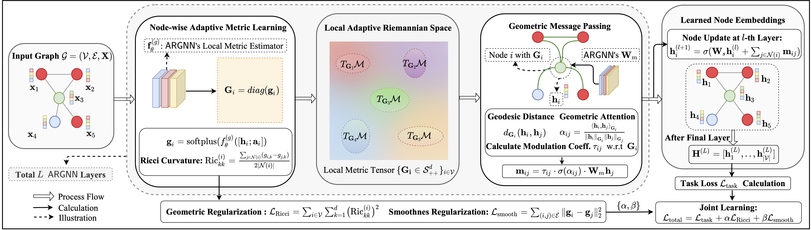

# [AAAI 2026] Adaptive Riemannian Graph Neural Networks (ARGNN)

[](https://www.python.org/) [](https://developer.nvidia.com/cuda-toolkit) 
[](https://pytorch.org/)
[](https://pytorch-geometric.readthedocs.io/) [](https://networkx.org/) [](https://github.com/geoopt/geoopt)
[](./LICENSE)

This repository provide the implementation of AAAI 2026 paper "*Adaptive Riemannian Graph Neural Networks*".

If you use this code in your research, please cite our paper:
```
@article{wang2025adaptive,
  title={Adaptive riemannian graph neural networks},
  author={Wang, Xudong and Li, Tongxin and Ding, Chris and Fan, Jicong},
  journal={arXiv preprint arXiv:2508.02600},
  year={2025}
}
```

## Overview

Adaptive Riemannian Graph Neural Networks (ARGNN) is a framework that learns a *continuous* and *anisotropic* Riemannian metric tensor field over a graph. Each node adapts its local geometry, allowing the model to better match the graph’s structural landscape.



## Project Structure
```
.
├── figs/                  # Figure directory
├── data/                  # Dataset directory (auto-downloaded)
├── GraphEnv.yml          # Conda environment configuration
├── README.md              # Project documentation
├── main.py               # Main training and evaluation script
├── models/                # Model definitions
│   └── argnn_model.py     # ARGNN model implementation
│   └── ...                # Other baseline methods implementation
├── utils/                 # Utility functions (modularized)
│   ├── seed_utils.py      # Random seed utilities
│   ├── logging_utils.py   # Logging, model saving, and record management
│   ├── data_utils.py      # Dataset loading and split management
│   ├── train_utils.py     # Training loops for different tasks
│   ├── eval_utils.py      # Evaluation metrics and performance assessment
│   └── loss_utils.py      # Loss functions and helper utilities
├── splits/                # Please put official GeomGCN's splits in this folder. Here we provide Cora/Citeseer and Pubmed splits as examples. 
│   └── ...                # Please download from https://github.com/bingzhewei/geom-gcn   
└── logs/                  # Training logs and saved models
    └── <dataset>_<timestamp>/  # Timestamped experiment directory
        ├── run_configs.json    # Experiment configuration
        ├── <dataset>_records.pkl  # Full training records
        ├── <dataset>_best_<run>.pth  # Best model per run
        └── <dataset>_global_best_model_<run>.pth  # Overall best model
```

## Usage and Quick Start

### Node Classification

The [example configurations](./Optimal-Config-Examples.sh) for node classification on Cora, Citeseer and PubMed datasets for a quick start, you can run the command like the following example:

```bash
python main.py --dataset Cora --epochs 200 --model argnn --optimizer adam --lr 0.005 \
                --num_runs 10 --argnn_hidden_dim 128 --argnn_num_layers 3 \
                --argnn_metric_hidden_dim 256 --argnn_metric_reg 0.01 \
                --argnn_smoothness_reg 0.001 --dropout 0.3 \
                --task node_classification --use_splits ./split
```

### Link Prediction

Example configuration for link prediction task:

```bash
python main.py --dataset Cora --epochs 500 --model argnn --optimizer adam --lr 0.005 \
                --num_runs 1 --argnn_hidden_dim 128 --argnn_num_layers 2 \
                --argnn_metric_hidden_dim 128 --argnn_metric_reg 0.01 \
                --argnn_smoothness_reg 0.001 --dropout 0.2 \
                --task link_prediction
```

## Parameter Descriptions

- `--dataset`: Name of the dataset (Cora, Citeseer, etc.)
- `--epochs`: Number of training epochs
- `--model`: Model architecture (argnn)
- `--optimizer`: Optimization algorithm (adam, sgd, etc.)
- `--lr`: Learning rate
- `--num_runs`: Number of training runs for statistical significance
- `--argnn_hidden_dim`: Hidden dimension of ARGNN layers
- `--argnn_num_layers`: Number of ARGNN layers
- `--argnn_metric_hidden_dim`: Hidden dimension for metric learning
- `--argnn_metric_reg`: Regularization coefficient for metric learning
- `--argnn_smoothness_reg`: Regularization coefficient for graph smoothness
- `--dropout`: Dropout rate
- `--task`: Task type (node_classification or link_prediction)
- `--use_splits`: Directory containing predefined data splits


## Requirements

### Hardware Requirements
- NVIDIA GPU with CUDA support with 8GB+ GPU memory
- Recommended: 16GB+ system memory

### Software Requirements
- Python 3.8+
- CUDA 12.1+

## Environment Setup

### 1. Check NVIDIA GPU and CUDA

First, verify that your system has an NVIDIA GPU available:

```bash
nvidia-smi
nvcc --version
```

If NVIDIA drivers are not installed, follow the [official NVIDIA guide](https://www.nvidia.com/Download/index.aspx) to install them.

### 2. Create Conda Environment

Create a conda environment using the provided configuration file:

```bash
conda env create -f GraphEnv.yml
```

This environment file includes all necessary libraries:
- PyTorch 2.1.0 (with CUDA support)
- PyTorch Geometric
- geoopt (for Riemannian optimization)
- networkx
- scikit-learn
- matplotlib
- seaborn

### 3. Activate Environment

```bash
conda activate Graph
```

## Contact
- Email: [xudongwang@link.cuhk.edu.cn](mailto:xudongwang@link.cuhk.edu.cn)